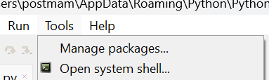
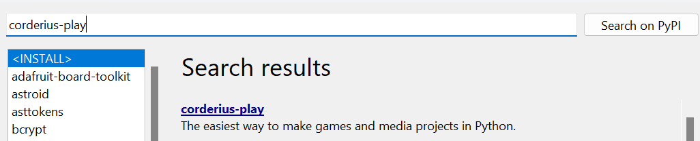

## Installeer corderius-play
Om de code uit dit project gebruiken moeten we nog iets extra's op onze computer installeren. Dit heet een package.

Mocht je bekend zijn met **pip**, dan kun je het package installeren via:
```bash
pip install corderius-play
```

In Visual Studio Code moet je hiervoor eerst de terminal openen met Ctrl-Shift-+.

Anders kunnen we het uiteraard via Thonny installeren:
Klik op "Tools" en daarna "Manage packages"



Zoek vervolgens naar "corderius-play" en installeer het



