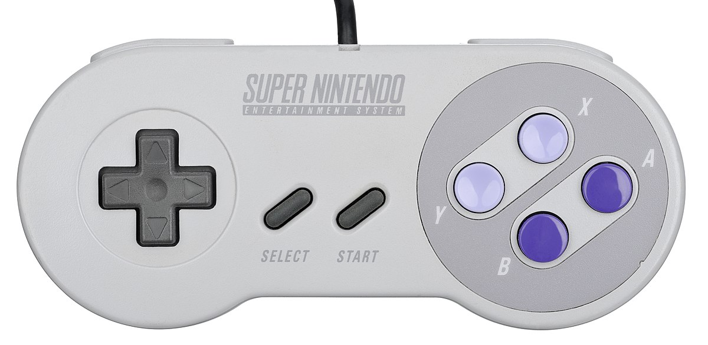

# SNES controller verbinden



Kan ik een spel programmeren waarbij de gebruiker een SNES controller as input gebruikt? Zeker!

## Verbinden
Verbind de SNES controller aan je computer met de USB-kabel.
Draai vervolgens het volgende script:

```python
import play

all_controllers = play.controllers.get_all_controllers()
for a_controller in all_controllers:
    print(f'Controller: {a_controller.get_instance_id()}')
```

Als het goed is, zou je iets moeten zien wat hierop lijkt:
```
pygame 2.5.2 (SDL 2.28.3, Python 3.11.7)
Hello from the pygame community. https://www.pygame.org/contribute.html
Controller: 0
```
Het belangrijkste is:
```markdown
Controller : 0
```
Je weet nu dat het nummer van je controller **0** is. Als je meer dan één SNES controller verbindt, dan zou je hier twee getallen moeten zien.
