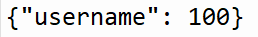

# Opslaan van een high score

```python 
import play
from play import db

db.set_data("username", 100)

play.start_program()
```

## Stap 1: draai de code
Open het bestand "database.json" (zou moeten staan in dezelfde map als je Python bestand).
Ziet het bestand er zo uit?



## Stap 2: Hoe werkt dit?

```python
from play import db
```
We importeren **db**, wat het gedeelte van de package is die ons helpt om high scores op te slaan op je computer.


```python 
db.set_data("username", 100)
```
We voegen aan de database toe dat:
- **username**: iemand met de gebruikersnaam **username**
- **100**: een nieuwe high score heeft van 100

## Stap 3: veranderen

Wat gebeurt er met je high scores als je dit stukje code ook draait?

```python 
import play
from play import db

db.set_data("username", 80)

play.start_program()
```
