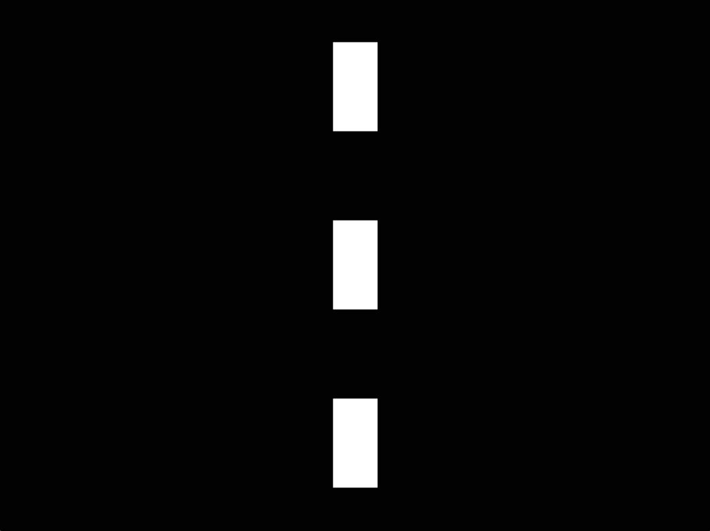

# 1.3 Je eerste rechthoek

We kunnen ook andere vormen tekenen, bijvoorbeeld een rechthoek.

```python
import play

play.new_box()

play.start_program()
```

Als het goed is, zie je een rechthoek op je scherm.

## Wat kan ik allemaal aanpassen?
Net zoals bij **play.new_circle** heeft het programma voor ons nu ook al de kleur en grootte bepaald. Je kunt dit zelf natuurlijk aanpassen!
Dit zijn de attributen voor **play.new_box**:
- **color**: staat standaard op 'black'. [Op deze pagina](https://www.pygame.org/docs/ref/color_list.html) zie je welke opties er zijn.
- **x**: staat standaard op 0 (het midden). Lager dan 0 is naar links, boven 0 is naar rechts.
- **y**: staat standaard op 0 (het midden), Lager dan 0 is naar beneden, boven 0 is naar boven.
- **width**: de breedte van de rechthoek.
- **height**: de hoogte van de rechthoek.
- **border_color**: staat standaard op  'light blue'. Let op, als de **border_width** 0 is, zie je de rand niet.
- **border_radius**: the breedte van de rand. Staat standaard op 0 (geen rand zichtbaar)
- **transparency**: 0 --> onzichtbaar. 100 --> volledig zichtbaar.

Om bijvoorbeeld de hoogte en breedte aan te passen kun je het volgende doen:

```python
import play

play.new_box(width=200, height=200)

play.start_program()
```

## Opdracht X.X een weg tekenen

We gaan deze afbeelding namaken met **play.new_box**


Maar hoe doen we dat eigenlijk? We helpen je een beetje op gang:

```python
import play

# een zwarte achtergrond
play.new_box(width=800, height=600)

# een eerste wit rechthoek
play.new_box(color='white')
# PAS DEZE CODE AAN

play.start_program()
```


