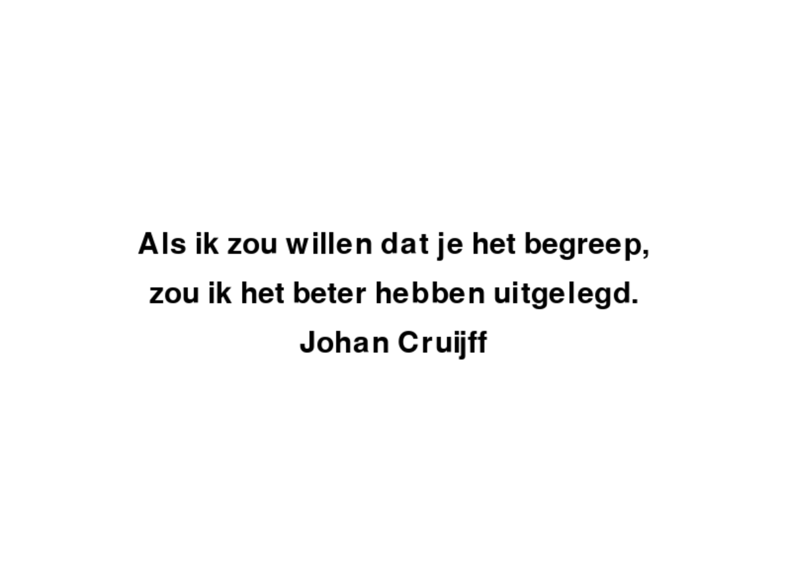

# 1.4 Je eerste tekst
We missen nog één ding: een tekst. Het is toch wel fijn als onze tekeningen en spellen ook tekst kunnen hebben.

Uiteraard is het systeem hetzelfde als bij **play.new_circle** en **play.new_box**.
Je kunt voor **play.new_text** kiezen uit:
- **words**: de woorden die op het scherm komen te staan
- **x**: x-positie. Staat standaard op 0 (het midden). Kleiner dan 0 is naar links, groter dan 0 is naar rechts.
- **y**: y-positie. Staat standaard op 0 (het midden). Kleiner dan 0 is naar beneden, groter dan 0 is naar boven.
- **font**: de font van de tekst. Kun je bijvoorbeeld aanpassen naar 'arial'.
- **font_size**: de grootte van de font.
- **color**: de kleur van de tekst.

Hierbij een voorbeeld:

```python
import play

play.new_text(words='hallo pythonista', font='arial', font_size=30)

play.start_program()
```

### Opdracht 1.4.1 Johan Cruijff

Maak onderstaande afbeelding na.



```python
import play

# PAS ONDERSTAANDE CODE AAN
play.new_text(words='Als ik zou willen dat je het begreep,')

play.start_program()
```

<details>
    <summary>Klik hier voor een tip!</summary>

Het zijn drie **play.new_text** aanroepen en we gebruiken 'arial' als font.
De font_size is 40.

</details> 

<details>
    <summary>Klik hier voor een oplossing!</summary>

```python
import play

play.new_text(words='Als ik zou willen dat je het begreep,', y=100, font='arial', font_size=40)
play.new_text(words='zou ik het beter hebben uitgelegd', y=0, font='arial', font_size=40)
play.new_text(words='Johan Cruijff', y=-100, font='arial', font_size=40)

play.start_program()
```

</details>


